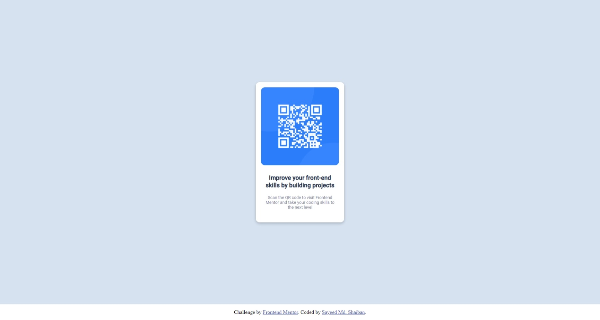

# Frontend Mentor - QR code component solution

This is a solution to the [QR code component challenge on Frontend Mentor](https://www.frontendmentor.io/challenges/qr-code-component-iux_sIO_H). Frontend Mentor challenges help you improve your coding skills by building realistic projects.

## Table of contents

- [Overview](#overview)
  - [Screenshot](#screenshot)
  - [Links](#links)
- [My process](#my-process)
  - [Built with](#built-with)
  - [What I learned](#what-i-learned)
  - [Continued development](#continued-development)
  - [Useful resources](#useful-resources)
- [Author](#author)


## Overview

### Screenshot




### Links

- Solution URL: [git repo](https://github.com/sayeedk06/FM-QR-codeComponent)
- Live Site URL: [live site URL](https://sayeedk06.github.io/FM-QR-codeComponent/)

## My process

### Built with

- HTML5
- CSS

### What I learned

Learned to center a div vertically and horizontally. Used margin to center div horizontally and flexbox to center div vertically

```html
<div class="card">
  <div class="imageFrame">
    
  </div>
  <div class="bodyText">
    <h3>Improve your front-end skills by building projects</h3>
    <br />
    <p>
      Scan the QR code to visit Frontend Mentor and take your coding skills to
      the next level
    </p>
  </div>
</div>
```

```css
main {
      background-color: hsl(212, 45%, 89%);
      min-height: 100vh;
      display: flex;
      justify-content: center;
      font-family: 'Roboto', sans-serif;;
    }
.card {
  background-color: hsl(0, 0%, 100%);
  width: 15rem;
  min-height: 25rem;
  border-radius: 0.75rem;
  margin: auto;
  padding: 1rem;
  text-align: center;
  display: grid;
  box-shadow: 0px 4px 8px 0px rgba(0, 0, 0, 0.2);
}
```


### Continued development

Want to get more confortable with using grid

### Useful resources

- [Example resource 1](https://www.w3schools.com/css/css_align.asp) - This helped with the alignment.

## Author

- Website - [Sayeed Md Shaiban](https://sayeedshaiban.fyi/)
- Frontend Mentor - [@sayeedk06](https://www.frontendmentor.io/profile/sayeedk06)
- Twitter - [@evrydaywannabe](https://twitter.com/evrydaywannabe)


